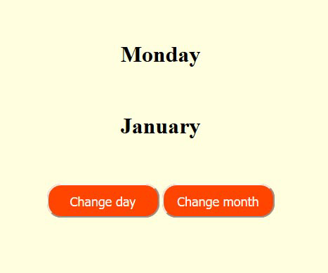

# Exercises with ButtonDemo.html

The web page specified by `ButtonDemo.html` contains a button that changes the text displayed on the screen when pressed. The JavaScript function `change_text()` is invoked upon pressing the button, cycling the text between "Hello!" and "Well done!".

## Exercise 1
Modify the program so that the initial text shown on the screen is "Monday". The text should change as follows each time the button is pressed: Monday ... Tuesday ... Wednesday ... Thursday ... Friday ... Saturday ... Sunday ... Monday ... Tuesday ... etc.

### Instructions
- Change the button text to "Change day".
- You can use a `long if ... else if ... else if ...` construct inside the JavaScript function.
- Alternatively, use an array of strings and an index variable. Add the following definitions before the `change_text()` function:
  ```javascript
  var day_index = 0;
  var days_of_week = ["Monday", "Tuesday", "Wednesday", "Thursday", "Friday", "Saturday", "Sunday"];


## Exercise 2:
Improve the program by adding another centered text and another button to the page. When
the new button is pressed it should change the new text in the following way: January ...
February ... March ... April ... etc.
You should use a new JavaScript function that will be called after the new button is pressed.
You could also use the following definitions in your program:
var month_index = 0;
var names_of_months = ["January", "February", "March", "April", "May", "June", "July", "August", "September", "October", "November", "December"];

## Exercise 3:
Use CSS definitions to make the background of the entire page light yellow.

## Exercise 4:
Use CSS definitions to make the buttons bigger and better-looking. The page could look like
the following:

Try also button:hover and button:active definitions for your buttons. For example, with
the following definition the button background color changes when the mouse cursor
’hovers’ over the button:
button:hover
{
background-color : GoldenRod ;
}


Link to solution: file:///C:/Users/anyamai.anand/OneDrive%20-%20NASHTECH/05_sumary_exersises/exercise.html